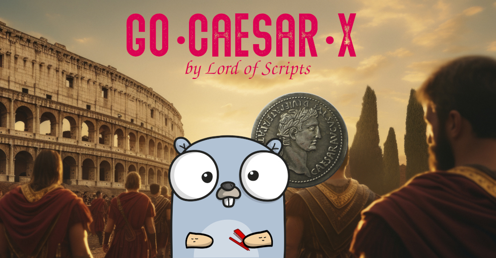

# Bellaso Cipher

[](https://pkg.go.dev/github.com/lordofscripts/caesarx)
[](https://github.com/lordofscripts/caesarx/releases/latest)
[](https://github.com/lordofscripts/caesarx/blob/master/LICENSE)
[](https://goreportcard.com/report/github.com/lordofscripts/caesarx)




## History

Things get interesting! This cipher is based on the Caesar concept but takes things further. 
This cipher was invented by *Giovan Battista Bellaso* who was born in Brescia around 1505.
He was an Italian cryptologist.

In 1553 he published "la Cifra del Signore Giovan Battista Bellaso". Sadly, his invention was
later mistakenly attributed to the younger *Blaise de Vigenère* when in fact, Vigenere used
Bellaso's work to add a variation: The Autokey cipher.

I feel credit must be given where it is due, that's why my module and application make the
difference between Bellaso's and Vigenères.

**NOTE: ** *The Bellaso cipher works with character duplets, but that works against the
cipher's strength by limiting the (already limited) number of keys to half. Therefore, my
Bellaso variant works by repeating the key rather than creating the key duplets.*

## Strengths & Weaknesses

Strengths:
* Polyalphabetic cipher as opposed to Caesar's single key which is very predictable and limited combinations.
* The longer the secret the better

Weaknesses:
* It is still a substitution cipher
* The key repeats over the input


## Encryption & Decryption

Encryption and decryption still follow the same workflow as the plain Caesar cipher, that
means you can always help yourself (if you don't have a program) with a Tabula Recta,
or a Caesar disk (as long as you rotate it for every key).

We need a **Secret**, not a (single-letter)
key but a secret. This secret is one or more words, a phrase and the longer and the more
different characters it has the better! In terms of Caesar jargon, each letter of this
*secret* becomes a *key*, that's why it is a polyalphabetic substitution cipher.

The process here is that each of the letters in the Secret or Password (*Contrasegna* as
Bellaso called it), is placed over *each of the translatable letters*  of the input
stream. Since this Secret is usually (and not necessarily) shorter than the input message,
we **repeat** the Secret over and over again in the said manner until we cover all 
characters in the input message.

Once that is done, we use the corresponding Secret's letter/key to encode/decode the
corresponding plain/cipher message character. Do notice that characters that are neither
in the Primary nor Slave alphabet are passed as-is (no translation). More importantly,
those characters from the message that are absent from the Reference Alphabets **do not**
have a corresponding letter from the secret, i.e. they have nothing.


### For Best Results

These are suggestions to secure your message, but it is not compulsory.

* Remove from the plain message all characters that are not present in the Primary and Slave Reference alphabets
* To conceal the length of the original message, pad the plain text with random characters.
* Do not use words as the Secret Key, instead use a secret based on random characters
* The secret key should be as long as the message
* Don't use the same secret for other messages, always change the secret
* Protect the secret key with your life

## Using it with GoCaesarX

Use the same CLI options (`-alpha LANGUAGE`) that you would with Caesar but for Bellaso:

* Use `-variant bellaso` to select this cipher.
* Add the `-secret '<SECRET>'` option to specify a secret that is a word, or preferably a phrase.
	
Example:
	
```
	caesarx -variant bellaso -alpha english -secret "ADJX" "Kiss at Dusk"
```

Alternatively, you could use:

```
	bellaso -alpha english -secret "ADJX" "Kiss at Dusk"
```
	
The output would look like:
	
```
	🔱 Go CaesarX v0.1.0-Alpha-0 (C)2025 Didimo Grimaldo 🔱
				 ⚞◕͜ ◕⚟
	☕ Buy me a Coffee? https://www.buymeacoffee/lostinwriting
	=========================================
Alphabet :  English
Secret   :  ADJX
Algorithm:  Bellaso
Plain    :  Kiss at Dusk
Encoded  :  Klbp dc@Dxbh

	☕ Buy me a Coffee? https://www.buymeacoffee/lostinwriting
```

***
Copyright &copy;2025 Lord of Scripts
