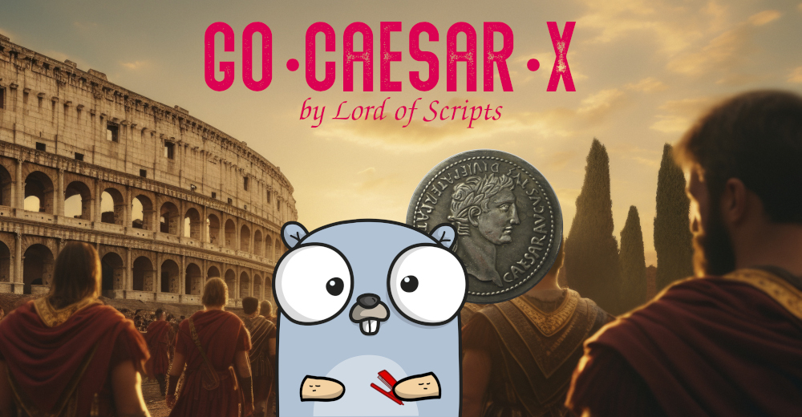

# Didimus Cipher

[](https://pkg.go.dev/github.com/lordofscripts/caesarx)
[](https://github.com/lordofscripts/caesarx/releases/latest)
[](https://github.com/lordofscripts/caesarx/blob/master/LICENSE)
[](https://goreportcard.com/report/github.com/lordofscripts/caesarx)




## History

No history here! This is just a play cipher I "invented" for a slight improvement over
the plain Caesar. Have fun with it! It is just that, a toy cipher.


## Strengths & Weaknesses

Strengths:
* A polyalphabetic **double-key** substitution cipher
* For any alphabet with N characters, the possibilities increase considerably. For English (N=26) we have 676 combinations, using the Spanish (N=33) alphabet we get 1089 combinations.
* With the addition of the Numbers and Symbols (default) the **effective** alphabet is extended to 50 characters (33 from primary, 17 from slave) it becomes more difficult to attack the cipher (but not impossible!)
* As opposed to Caesar, any character in the reference alphabets may have 2 different values in the output stream.

Weaknesses:
* Same as Caesar but to a lesser extent due to the extended alphabet and the use of two encryption keys

Drawback:

* MANUAL encoding/decoding is more laborious because the operator needs to be focused on knowing the number of skipped characters at any given time in order to calculate the effective ordinal position that is used to choose either the Primary or Alternate keys. But it is still possible!

## Encryption & Decryption

This simple contraption follows the same character substitution workflow that we use in
the plain Caesar cipher. The difference here is that we have two keys:

* The **Primary Key** 𝑘₀ (same as Caesar) is used for *even positions* thus 0,2,4...
* The **Alternate Key** 𝑘₁ is used for *odd positions* thus 1,3,5...

A key point here is that, whereas in plain Caesar even the inclusion of out-of-alphabet characters
in the input stream represents no change in odd/even because the same (single) key is used.
In *Didimus* it does! Why? because the odd/even assertion *is not based* merely on the 
ordinal position of the target character in the input stream. Instead, the odd/even key selection
assertion is based on the ordinal position *minus* the number of *skipped* characters.
The skipped characters are those that were passed as-is from input to output because it
was not part of *neither* the Primary *nor* the Slave Reference Alphabets.

As an example, if we are encoding the 15th (odd number) character in the input stream,
IF there are no skipped characters (everything was in the alphabets) thus far, then
the Alternate (Odd) Key would be chosen. But, if 3 characters had been skipped, the
*effective ordinal position* would be `15 - 3 = 12` which is an even number and thus the
Primary Key would be chosen for that character.


## Using it with GoCaesarX

Use the same CLI options that you would with plain Caesar except that for Didimus
you would:

* Use `-variant didimus` to select this cipher.
* Add the `-offset <INTEGER>` option to specify a **shift offset** of <INTEGER> positions with respect to the **Primary Caesar key**.
	
Example:
	
```
	caesarx -variant didimus -alpha english -key G -offset 3 "fantastic 2025"
```
	
Here, "G" is the Primary Caesar Key (shift=6), and the offset of 3 shift positions with
respect to "G" makes `6 + 3 = 9` where 9 corresponds to letter "J" (in the selected alphabet)
as the **Alternate Key**:
	
```
	🔱 Go CaesarX v0.1.0-Alpha-0 (C)2025 Didimo Grimaldo 🔱
				 ⚞◕͜ ◕⚟
	☕ Buy me a Coffee? https://www.buymeacoffee/lostinwriting
	=========================================
Alphabet :  English
Key      : G (shift=6)
Algorithm:  English 𝑫ƒ𝓍 (𝑘₀=G,𝑘₁=J)
Plain    :  fantastic 2025
Encoded  :  ljtcgbzri2898+
NGram-5  :  ljtcg·bzri2·898+

	☕ Buy me a Coffee? https://www.buymeacoffee/lostinwriting	
```

As you can observe, the letter "a" from the input message appears as both letters
"j" and "g". With those same parameters, if the input letter "a" had been an "o" 
as in "fontostic 2025" then they would have appeared as "x" and "u" instead.
	
I also included how the output message would look had I used the `-ngram 5` option.
	
***
Copyright &copy;2025 Lord of Scripts

